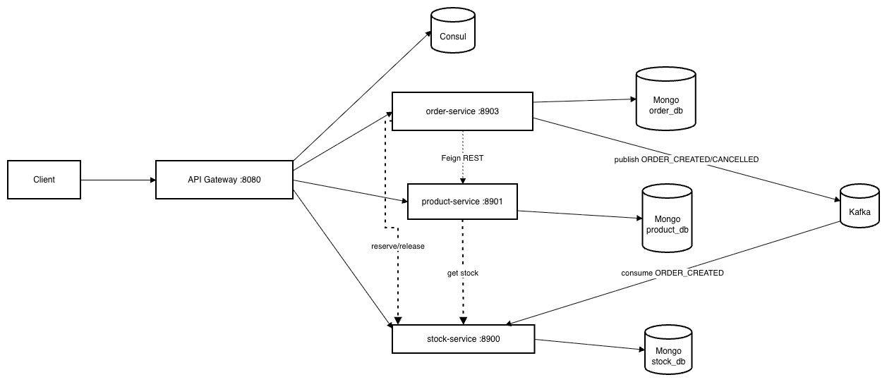

# Project Architecture

## Overview

This project is a microservices-based system using:

- **Spring Boot** services
- **Consul** for service discovery/registry
- **Spring Cloud Gateway** as API Gateway
- **MongoDB** for persistence
- **Kafka** for asynchronous order events

The system demonstrates **both synchronous REST communication** (Feign) and **asynchronous event-driven communication** (Kafka).

## Services and Responsibilities

- **api-gateway** (`:8080`)
  - Single entry point for clients
  - Routes to `product-service`, `stock-service`, and `order-service` via `lb://` + Consul discovery
- **product-service** (`:8901`)
  - Manages product catalog
  - Calls `stock-service` to enrich product responses with current available stock
- **stock-service** (`:8900`, `:8902`)
  - Maintains stock quantities and reservations
  - Supports reserve/release/confirm patterns
  - Confirms reservations when `ORDER_CREATED` event is consumed from Kafka
- **order-service** (`:8903`)
  - Creates and cancels orders
  - Orchestrates synchronous calls to `stock-service` and `product-service`
  - Publishes order lifecycle events to Kafka

## Infrastructure Components

- **Consul cluster** (3 nodes): service registry and health-aware discovery
- **Kafka (KRaft single-node)**: event bus
  - Topics used: `order-created`, `order-cancelled`
- **MongoDB**
  - `product_db` for product-service
  - `stock_db` for stock-service
  - `order_db` for order-service

## High-Level Component Diagram

## Request/Processing Flows

### 1) Create Order (Reserve -> Persist -> Confirm via Kafka)

1. Client calls `POST /order` via API Gateway.
2. `order-service` calls `stock-service` reserve endpoint with `orderId` and quantity.
3. If reservation succeeds, `order-service` calls `product-service` to read product details for response.
4. `order-service` persists order with status `CREATED`.
5. `order-service` publishes `ORDER_CREATED` event to Kafka.
6. `stock-service` consumes `ORDER_CREATED` and **confirms reservation** (moves reserved quantity to permanent stock reduction).
7. `order-service` returns response containing product name, available stock, and ordered quantity.

### 2) Cancel Order

1. Client calls `PUT /order/{id}/cancel`.
2. `order-service` performs restock via `stock-service`.
3. `order-service` updates order status to `CANCELLED`.
4. `order-service` publishes `ORDER_CANCELLED` event to Kafka (informational/audit).
5. `order-service` calls `product-service` for enriched response payload.

## Discovery and Routing

- All services register with Consul using `spring.application.name`.
- API Gateway routes:
  - `/product/**` -> `product-service`
  - `/stock/**` -> `stock-service`
  - `/order/**` -> `order-service`
- Inter-service REST calls use service names (load-balanced via discovery).

## Resilience Strategy (order-service)

- Feign client timeouts configured for external service calls.
- Retry + circuit breaker (Resilience4j) used for product and stock interactions.
- Fallback behavior returns service-unavailable semantics when dependencies fail.

## Current Trade-offs and Notes

- Reservation confirmation is event-driven (good for demonstrating async processing).
- Kafka publish is still not outbox-backed; if DB commit succeeds and publish fails, inconsistency is possible.
- Reservation TTL/reaper is not implemented yet; stale reservations may require explicit cleanup.
