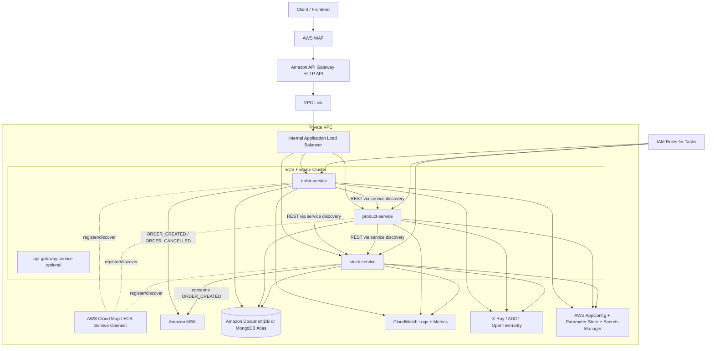

# AWS Cloud Migration Guide for the Current Spring Microservices Project

## 1) Purpose and Scope

This guide explains how to evolve the current on-prem/local microservice architecture into a native AWS design (not Docker Compose on EC2). It focuses on replacing or re-mapping the current platform concerns:

- Registry / Service Discovery
- Load Balancing
- API Gateway
- Tracing
- Logging
- Resilience (timeouts, retries, circuit breaker)
- Config Server
- Security
- REST and Messaging

It also explains the architecture shape in AWS, what changes in code/config, and why each AWS choice fits this project.

---

## 2) Current Architecture (Baseline)

Today the system uses:

- Spring Cloud Gateway
- Consul service registry
- Feign-based synchronous calls between services
- Kafka for async order events (`order-created`, `order-cancelled`)
- MongoDB databases per service
- ELK for centralized logging
- Resilience4j patterns in `order-service`

Services:

- `api-gateway`
- `product-service`
- `stock-service`
- `order-service`
- `config-server`

---

## 3) Recommended AWS Target Architecture (High Level)

### Recommended compute platform

Use **Amazon ECS on Fargate** (serverless containers) for all Spring Boot services.

Why this is a good fit:

- Minimal ops overhead vs managing Kubernetes control planes
- Works well for containerized Spring Boot services from your existing Dockerfiles
- Integrates natively with Cloud Map, ALB, CloudWatch, IAM task roles, and Service Auto Scaling

### Reference AWS architecture (logical)

> Note: You may keep `api-gateway` Spring service for route-level custom logic if needed, but in many AWS deployments, Amazon API Gateway + ALB routing is enough. See option analysis below.

---

## 4) Capability-by-Capability Option Analysis and Recommendation

## 4.1 Registry / Service Discovery

### Options

1. **AWS Cloud Map (with ECS Service Discovery / Service Connect)**
2. Self-managed **Consul** on ECS/EC2
3. Kubernetes-native discovery (if moving to EKS)

### Pros / Cons

- **Cloud Map**
  - Pros: native AWS integration, low ops, works directly with ECS, supports DNS discovery
  - Cons: fewer advanced features than full Consul ecosystem
- **Self-managed Consul**
  - Pros: feature parity with current environment
  - Cons: operational burden, HA complexity, more failure modes
- **EKS-native discovery**
  - Pros: powerful if you standardize on Kubernetes
  - Cons: adds Kubernetes complexity not required for this project

### Choice

**Choose AWS Cloud Map + ECS Service Connect.**

### How to implement in this project

- Remove Consul dependencies and registration config from Spring services.
- In ECS service definitions, enable Service Connect or Cloud Map registration per service (`order-service`, `product-service`, `stock-service`).
- Update inter-service URLs to use Cloud Map DNS names (for example, `http://stock-service.namespace:8900`).
- Keep Feign clients but point to discovered service DNS names.

---

## 4.2 Load Balancing

### Options

1. **Application Load Balancer (ALB)**
2. Network Load Balancer (NLB)
3. Client-side load balancing only (Spring Cloud LoadBalancer)

### Pros / Cons

- **ALB**
  - Pros: L7 routing, host/path rules, health checks, good for REST microservices
  - Cons: slightly higher cost than basic L4 in some scenarios
- **NLB**
  - Pros: high throughput / low latency L4
  - Cons: no advanced HTTP path routing
- **Client-side only**
  - Pros: lower infra components
  - Cons: weaker centralized routing/observability controls

### Choice

**Choose ALB** for HTTP microservices.

### How to implement

- Create one internal ALB in private subnets.
- Create target groups per service (`/order/*`, `/product/*`, `/stock/*`).
- Attach ECS services to their target groups.
- Configure ALB health checks to each service actuator endpoint.

---

## 4.3 API Gateway

### Options

1. **Amazon API Gateway HTTP API** (front door) + ALB private integration
2. Keep **Spring Cloud Gateway** as edge API gateway in ECS
3. API Gateway REST API (full-featured legacy flavor)

### Pros / Cons

- **API Gateway HTTP API**
  - Pros: managed auth, throttling, JWT authorizers, lower latency/cost vs REST API
  - Cons: some advanced gateway features are less extensive than REST API
- **Spring Cloud Gateway only**
  - Pros: full control in code, already familiar
  - Cons: you own scaling/availability/security hardening
- **API Gateway REST API**
  - Pros: richest legacy gateway feature set
  - Cons: typically higher cost/complexity than HTTP API for common cases

### Choice

**Choose API Gateway HTTP API as external gateway.** Keep `api-gateway` service only if you need custom Spring filters/business-aware routing not possible with API Gateway policies.

### How to implement

- Expose API Gateway publicly.
- Connect API Gateway to private ALB using VPC Link.
- Define route mappings: `/order/{proxy+}`, `/product/{proxy+}`, `/stock/{proxy+}`.
- Move coarse-grained policies (auth, throttling, CORS) from app gateway into API Gateway where possible.

---

## 4.4 Tracing

### Options

1. **AWS X-Ray with OpenTelemetry (ADOT Collector)**
2. Self-managed Jaeger/Zipkin on ECS/EKS
3. CloudWatch only (no distributed traces)

### Pros / Cons

- **X-Ray + ADOT**
  - Pros: managed backend, service map, AWS-native integration
  - Cons: migration effort from any existing tracing libs
- **Jaeger/Zipkin self-managed**
  - Pros: ecosystem flexibility
  - Cons: operational overhead
- **Logs-only**
  - Pros: simple
  - Cons: poor cross-service latency root-cause visibility

### Choice

**Choose ADOT + X-Ray.**

### How to implement

- Add OpenTelemetry SDK auto-instrumentation or Micrometer tracing bridge in each service.
- Run ADOT collector as sidecar (or daemon service) in ECS.
- Send traces to X-Ray; correlate trace IDs in logs.

---

## 4.5 Logging

### Options

1. **CloudWatch Logs** (with optional subscription to OpenSearch)
2. Amazon OpenSearch as primary logging store
3. Self-managed ELK on EC2/ECS

### Pros / Cons

- **CloudWatch Logs first**
  - Pros: low ops, native ECS integration, retention controls
  - Cons: complex analytics less rich than full ELK out-of-box
- **OpenSearch primary**
  - Pros: strong search/analytics dashboards
  - Cons: higher cost and tuning/ops effort
- **Self-managed ELK**
  - Pros: total control
  - Cons: high operational burden

### Choice

**Choose CloudWatch Logs as default**, optionally stream to OpenSearch for advanced search dashboards.

### How to implement

- Configure ECS `awslogs` (or FireLens) log driver per service.
- Emit structured JSON logs from Spring Boot (`logback-spring.xml`).
- Set retention and log metric filters (error rate, p95 latency indicators).

---

## 4.6 Resilience (Circuit Breaker, Retry, Timeout, Bulkhead)

### Options

1. Keep **Resilience4j** in application code + AWS infra timeouts
2. Service mesh policies (App Mesh)
3. Rely only on infra retries/load balancing

### Pros / Cons

- **Resilience4j + infra controls**
  - Pros: explicit business-aware fallback behavior, already present in project
  - Cons: requires disciplined per-client config management
- **App Mesh**
  - Pros: central traffic policies
  - Cons: extra platform complexity
- **Infra-only**
  - Pros: simpler app code
  - Cons: lacks domain-specific fallback semantics

### Choice

**Keep Resilience4j** in services (especially `order-service`) and add aligned AWS timeout/retry limits.

### How to implement

- Preserve current circuit breaker/retry annotations around Feign clients.
- Define strict HTTP client timeouts.
- Tune API Gateway and ALB timeouts to avoid retry storms.
- Add CloudWatch alarms on circuit-open rate and dependency failure rate.

---

## 4.7 Config Server

### Options

1. **AWS AppConfig + SSM Parameter Store + Secrets Manager**
2. Keep Spring Cloud Config Server (run on ECS)
3. Hardcoded env vars only

### Pros / Cons

- **AppConfig + Parameter Store + Secrets Manager**
  - Pros: managed, versioned, rollout/validation, native secret handling
  - Cons: requires refactor from Spring Config Server patterns
- **Spring Config Server on ECS**
  - Pros: minimal code changes from current architecture
  - Cons: another service to operate and scale
- **Env vars only**
  - Pros: simplest
  - Cons: weak governance/versioning and painful rotation

### Choice

**Choose AppConfig + Parameter Store + Secrets Manager.**

### How to implement

- Non-secret config in AppConfig/Parameter Store (`/project/prod/order-service/*`).
- Secrets (DB URIs, credentials, API keys) in Secrets Manager.
- Use Spring Cloud AWS / AWS SDK integration to load parameters at startup and optionally refresh.
- Decommission `config-server` after all services are migrated.

---

## 4.8 Security

### Options

1. **API Gateway JWT authorizer + Cognito** for client auth
2. External IdP (Auth0/Okta) + API Gateway JWT
3. Custom auth in Spring gateway only

Complementary controls:

- IAM task roles for service-to-AWS access
- Security groups and private subnets
- AWS WAF at API edge
- KMS encryption and TLS everywhere

### Pros / Cons

- **Cognito + API Gateway**
  - Pros: managed auth, JWT verification at edge, good AWS integration
  - Cons: Cognito UX/customization trade-offs
- **External IdP + JWT**
  - Pros: enterprise SSO flexibility
  - Cons: extra integration cost
- **Custom auth in app**
  - Pros: full flexibility
  - Cons: more security responsibility in code

### Choice

**Choose API Gateway JWT auth + Cognito** (unless institution/company mandates external IdP).

### How to implement

- Protect external endpoints at API Gateway with JWT authorizer.
- Keep service-level authorization checks in Spring Security for defense-in-depth.
- Use IAM roles for ECS tasks to access SSM/Secrets/MSK/CloudWatch without static credentials.

---

## 4.9 REST and Messaging

### REST Options

1. ECS services over HTTP via ALB + Cloud Map
2. Service mesh/mTLS for service-to-service REST
3. gRPC conversion (not required for this project)

### Messaging Options

1. **Amazon MSK (Managed Kafka)**
2. Amazon SQS/SNS redesign
3. Amazon EventBridge redesign

### Pros / Cons (Messaging)

- **MSK**
  - Pros: minimal change to existing Kafka producers/consumers and topic model
  - Cons: higher cost/ops than SQS for simple queues
- **SQS/SNS**
  - Pros: very managed and simple
  - Cons: requires redesign from Kafka streaming semantics
- **EventBridge**
  - Pros: event bus integrations and routing rules
  - Cons: different programming model vs existing Kafka topic flow

### Choice

**Choose MSK** for this project to preserve current event-driven behavior and reduce migration risk.

### How to implement

- Provision MSK cluster in private subnets.
- Migrate producer/consumer bootstrap configs to MSK brokers.
- Keep existing topics (`order-created`, `order-cancelled`) and consumer logic (`stock-service` confirmation flow).
- Add retry/DLQ strategy via Kafka retry topics or consumer error handlers.

---

## 5) What Changes in the Existing Codebase

## 5.1 Service bootstrap and discovery

- Remove Consul registration/discovery settings from `application.yml`/`application.properties`.
- Replace service URLs with Cloud Map DNS names or Service Connect aliases.

## 5.2 API edge

- Decide whether to retire `api-gateway` service or keep it for custom filters.
- If retired, move route/policy concerns to API Gateway + ALB rules.

## 5.3 Configuration management

- Replace Spring Cloud Config consumption with AWS parameter/secret loading.
- Split config into:
  - runtime config (AppConfig/Parameter Store)
  - secrets (Secrets Manager)

## 5.4 Observability

- Add tracing dependencies (OpenTelemetry/Micrometer + ADOT exporter path).
- Ensure logs are JSON and include correlation IDs (`traceId`, `spanId`, `orderId`).

## 5.5 Security and identity

- Add JWT resource server configuration aligned with Cognito issuer/audience.
- Remove any hardcoded credentials from config files.

## 5.6 Messaging

- Update Kafka client configs for MSK TLS/SASL/IAM mode as selected.
- Validate topic ACLs and client permissions.

---

## 6) Suggested AWS Service Mapping Table

| Current Capability | Current Tool                       | AWS Primary Choice                          | Notes                                  |
| ------------------ | ---------------------------------- | ------------------------------------------- | -------------------------------------- |
| Registry           | Consul                             | Cloud Map + ECS Service Connect             | Native discovery for ECS               |
| Load balancing     | Spring + Consul lb                 | ALB                                         | Path-based L7 routing                  |
| API Gateway        | Spring Cloud Gateway               | API Gateway HTTP API                        | Managed auth/throttle, VPC Link to ALB |
| Tracing            | (limited/custom)                   | X-Ray + ADOT                                | Distributed tracing and service map    |
| Logging            | ELK stack                          | CloudWatch Logs (optional OpenSearch)       | Lower ops, native ECS integration      |
| Resilience         | Resilience4j                       | Resilience4j + AWS timeout/alarm controls   | Keep domain-aware fallbacks            |
| Config server      | Spring Cloud Config Server         | AppConfig + SSM + Secrets Manager           | Managed config and secrets             |
| Security           | Spring Security + network controls | Cognito + API Gateway JWT + IAM roles + WAF | Strong edge and service security       |
| Messaging          | Kafka                              | MSK                                         | Minimal app-level refactor             |

---

## 7) Deployment and Runtime Architecture in AWS

1. Source code in GitHub/CodeCommit.
2. CI/CD using CodePipeline + CodeBuild (or GitHub Actions) builds Docker images.
3. Images stored in Amazon ECR.
4. ECS Fargate deploys each service with independent scaling policies.
5. API Gateway exposes public APIs and routes to private ALB.
6. Services discover each other via Service Connect/Cloud Map.
7. MSK handles async order events.
8. DocumentDB (or MongoDB Atlas on AWS) persists service data.
9. CloudWatch/X-Ray/alarms provide observability.

---

## 8) Step-by-Step Migration Plan (Practical)

## Phase 1: Foundation

- Build AWS networking baseline: VPC, private/public subnets, NAT, security groups.
- Create ECR repositories.
- Stand up ECS cluster (Fargate), ALB, Cloud Map namespace.
- Provision CloudWatch log groups and X-Ray.

## Phase 2: Data and Messaging

- Provision DocumentDB (or MongoDB Atlas) and MSK.
- Validate connectivity from ECS tasks to databases and brokers.

## Phase 3: Service Migration

- Containerize and deploy `product-service`, `stock-service`, `order-service` to ECS.
- Move discovery from Consul to Cloud Map.
- Keep Resilience4j and verify failover behavior.
- Switch Kafka endpoints to MSK.

## Phase 4: Edge and Security

- Configure API Gateway + VPC Link + ALB routes.
- Add Cognito/JWT authorizer, WAF, and throttling.
- Decommission public exposure from individual services.

## Phase 5: Config and Hardening

- Migrate from Spring Config Server to AppConfig/SSM/Secrets Manager.
- Turn on autoscaling, alarms, dashboards, and run chaos/failure tests.

## Phase 6: Cutover

- Run blue/green or canary rollout.
- Compare functional and latency/error SLOs.
- Retire Consul/config-server/legacy logging components.

---

## 9) Cost and Complexity Trade-off Notes

- ECS Fargate minimizes ops effort; EKS gives more flexibility but higher platform complexity.
- MSK is the least disruptive for your Kafka-based design; SQS/EventBridge can reduce cost in simpler event models but require redesign.
- CloudWatch-first logging keeps operations simple; add OpenSearch only when advanced search/analytics justify cost.
- Managed config/security services reduce operational risk and secret leakage compared to self-hosted alternatives.

---

## 10) Final Recommended Architecture for This Project

For this specific project, the best-fit AWS architecture is:

- **Compute:** ECS Fargate
- **Registry/Discovery:** Cloud Map + Service Connect
- **External API Gateway:** Amazon API Gateway HTTP API
- **Internal L7 routing:** ALB
- **Messaging:** Amazon MSK
- **Datastore:** DocumentDB (or MongoDB Atlas on AWS if full Mongo compatibility is required)
- **Tracing:** ADOT + X-Ray
- **Logging:** CloudWatch Logs (optional OpenSearch)
- **Resilience:** Keep Resilience4j in code + AWS alarms/timeouts
- **Config:** AppConfig + Parameter Store + Secrets Manager
- **Security:** Cognito + API Gateway JWT + IAM task roles + WAF + TLS/KMS

This approach preserves your current Spring architecture patterns where they add value (Feign, Resilience4j, Kafka event flow), while replacing self-managed platform components (Consul, self-hosted config/logging stacks) with AWS-managed services to improve scalability, security, and operational reliability.
