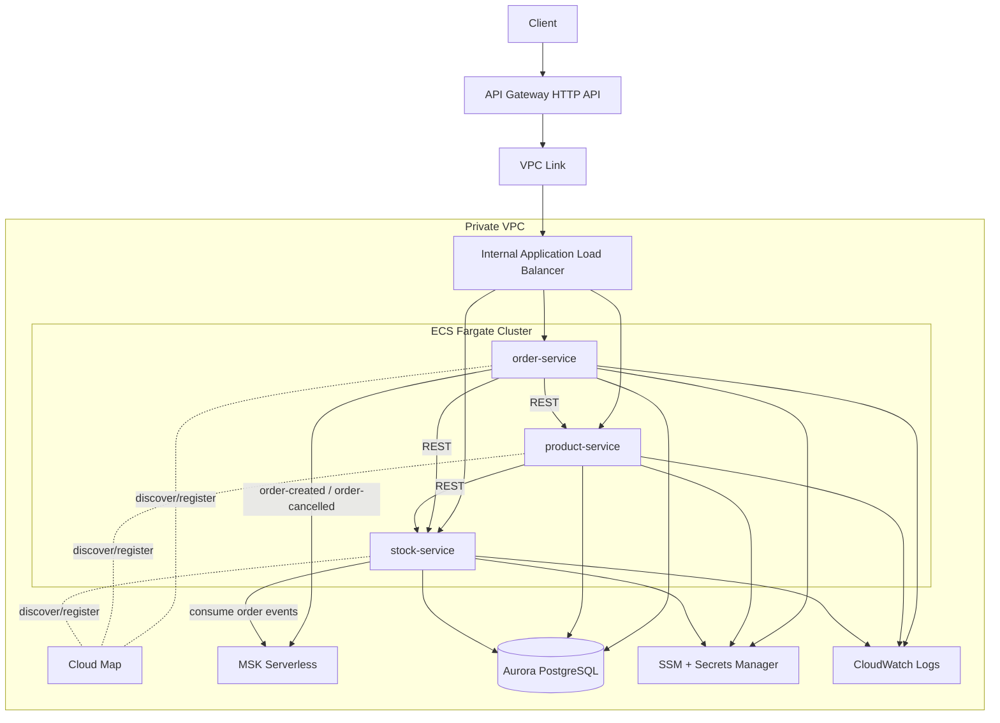

# AWS Implementation README

This document describes the **implemented AWS deployment** for this project and how to build, deploy, verify, and troubleshoot it.

## Scope

- Region: `us-east-2`
- Runtime: `ECS Fargate`
- Edge: `API Gateway HTTP API` + `VPC Link` + internal `ALB`
- Service discovery: `AWS Cloud Map`
- Database: `Aurora PostgreSQL`
- Messaging: `Amazon MSK Serverless` (IAM auth)
- Config & secrets: `SSM Parameter Store` + `Secrets Manager`
- Observability: `CloudWatch Logs` (+ optional X-Ray support)

---

## Architecture Diagram



---

## Request Flow (Implemented)

### A) Startup and service-discovery wiring (before any request)

1. Terraform creates Cloud Map private DNS namespace and service entries (`product-service`, `stock-service`, `order-service`) with `MULTIVALUE` routing.
2. Terraform stores base URLs in SSM Parameter Store, including `stock-service` URL as `http://stock-service.<namespace>:8900`.
3. ECS starts an `order-service` task.
4. During ECS task initialization (before Spring Boot starts), ECS resolves secrets/parameters and injects `STOCK_SERVICE_BASE_URL` (and other config) into container environment variables.
5. Spring Boot starts in `order-service`, and the Feign client is configured with `@FeignClient(... url = ${STOCK_SERVICE_BASE_URL...})`.
6. At this point, `order-service` has the stock hostname, but no stock IP is pinned yet; DNS resolution happens when a call is made.

### B) Detailed `POST /order` flow

1. Client sends `POST /order` to API Gateway HTTP API.
2. API Gateway forwards through VPC Link to the internal ALB listener.
3. ALB path rule for `/order` forwards to the `order-service` target group.
4. `order-service` receives request, validates payload (`quantity > 0`), and generates `orderId`.
5. `order-service` calls `OrderIntegrationService.reserveStock(...)`.
6. Resilience4j `Retry`/`CircuitBreaker` (`stockService`) wraps this method.
7. Feign builds request URL from `STOCK_SERVICE_BASE_URL`, e.g. `http://stock-service.<namespace>:8900/stock/{productNumber}/reserve?...`.
8. On this outbound call, the JVM resolver queries DNS for `stock-service.<namespace>` (Cloud Map name).
9. Cloud Map returns one or more healthy task IPs (MULTIVALUE policy, TTL-based DNS records).
10. HTTP call is sent to one selected stock task IP on port `8900`.
11. `stock-service` processes `/reserve`:

- success: returns updated stock,
- missing product: `404`,
- insufficient stock: `409`.

12. `order-service` maps reserve result:

- `404` -> returns `404`,
- `409` -> returns `409`,
- circuit/fallback/infra failure -> returns `503`.

13. If reserve succeeds, `order-service` calls `product-service` to enrich order response data.
14. If product lookup fails after reserve, `order-service` compensates by calling stock `release-reservation`.
15. If product lookup succeeds, `order-service` persists order in Aurora (`status=CREATED`).
16. `order-service` publishes `ORDER_CREATED` event to MSK topic (`order-created`).
17. `order-service` returns success payload to client.

### C) Where Cloud Map balancing actually happens

1. Balancing for `order-service -> stock-service` is DNS/client-side (Cloud Map), not ALB-based.
2. Each stock ECS task registers/deregisters in Cloud Map via ECS service registry.
3. As task health/status changes, the set of DNS answers changes.
4. New outbound calls from `order-service` can resolve to different stock task IPs over time (subject to DNS cache/TTL behavior).

---

## Terraform Structure

- `terraform/phase1-core`: networking, ECS/ECR, IAM, ALB, API Gateway, Cloud Map, data, service deployment.
- `terraform/phase2-support`: observability resources (logs/alarms/dashboard/X-Ray sampling).

Recommended apply order:

1. Apply `phase1-core` with `deploy_services = false`
2. Set MSK bootstrap brokers in SSM parameter
3. Build/push service images
4. Re-apply `phase1-core` with `deploy_services = true`
5. Apply `phase2-support`

---

## Build and Push (Order Service Example)

```bash
export JAVA_HOME=$(/usr/libexec/java_home -v 21)
export PATH="$JAVA_HOME/bin:$PATH"

mvn -f order-service/pom.xml -DskipTests package

aws ecr get-login-password --region us-east-2 \
  | docker login --username AWS --password-stdin 221342428586.dkr.ecr.us-east-2.amazonaws.com

docker buildx build --platform linux/amd64 \
  -t 221342428586.dkr.ecr.us-east-2.amazonaws.com/cs590-microservices/demo/order-service:latest \
  --push order-service
```

---

## Redeploy ECS Service

```bash
aws ecs update-service \
  --cluster cs590-microservices-demo-cluster \
  --service order-service \
  --force-new-deployment \
  --region us-east-2

aws ecs wait services-stable \
  --cluster cs590-microservices-demo-cluster \
  --services order-service \
  --region us-east-2
```

---

## Current Kafka Topic Strategy in Code

`order-service` includes startup topic beans:

- `order-created`
- `order-cancelled`

And enables:

- `spring.kafka.admin.auto-create=true`

This allows Spring Kafka Admin to attempt topic creation on startup (assuming MSK IAM permissions include topic creation).

---

## Required IAM Permissions for ECS Task Role (Kafka)

At minimum ensure task role permits:

- `kafka-cluster:Connect`
- `kafka-cluster:CreateTopic`
- `kafka-cluster:DescribeCluster`
- `kafka-cluster:DescribeTopic`
- `kafka-cluster:ReadData`
- `kafka-cluster:WriteData`
- `kafka-cluster:DescribeGroup`
- `kafka-cluster:AlterGroup`

---

## Verification Checklist

1. ECS service is stable (`desired=running`, no pending tasks).
2. ALB target for `order-service` is `healthy`.
3. `GET /order` returns HTTP `200`.
4. `POST /order` returns successfully (no timeout).
5. CloudWatch logs show successful Kafka send and no `UNKNOWN_TOPIC_OR_PARTITION` errors.

---

## Fast Circuit Breaker Demo (Order -> Stock, ~3 requests)

This project is configured so `order-service` opens the `stockService` circuit breaker after **3 failed calls**.

### 1) Deploy updated `order-service`

Build/push and force a new deployment (same commands as above).

### 2) Open CloudWatch logs for `order-service`

Watch for fallback lines from `OrderIntegrationService`, e.g.:

- `Circuit breaker fallback triggered for stock-service reserve ...`

Optional Logs Insights query (replace log group if needed):

```sql
fields @timestamp, @message
| filter @message like /Circuit breaker fallback triggered for stock-service/
  or @message like /CallNotPermittedException/
| sort @timestamp desc
| limit 100
```

### 3) Simulate stock outage (both ECS instances)

Temporarily scale `stock-service` desired count from `2` to `0` (or otherwise make both tasks unreachable).

### 4) Send only 3 create-order requests

Use your API Gateway endpoint and send 3 quick `POST /order` calls, for example:

```bash
API_BASE="https://<your-api-id>.execute-api.us-east-2.amazonaws.com"

for i in 1 2 3; do
  curl -s -o /dev/null -w "request-$i status=%{http_code} time=%{time_total}s\n" \
    -X POST "$API_BASE/order" \
    -H "Content-Type: application/json" \
    -d '{"productNumber":1,"quantity":1}'
done
```

Expected: responses become `503`, and fallback logs appear in `order-service` CloudWatch logs.

### 5) Show recovery quickly

Scale `stock-service` back to `2`, wait ~10 seconds (open-state wait duration), then send one more `POST /order`.

Expected: request succeeds again (assuming product/stock data is valid), demonstrating breaker recovery.

---
