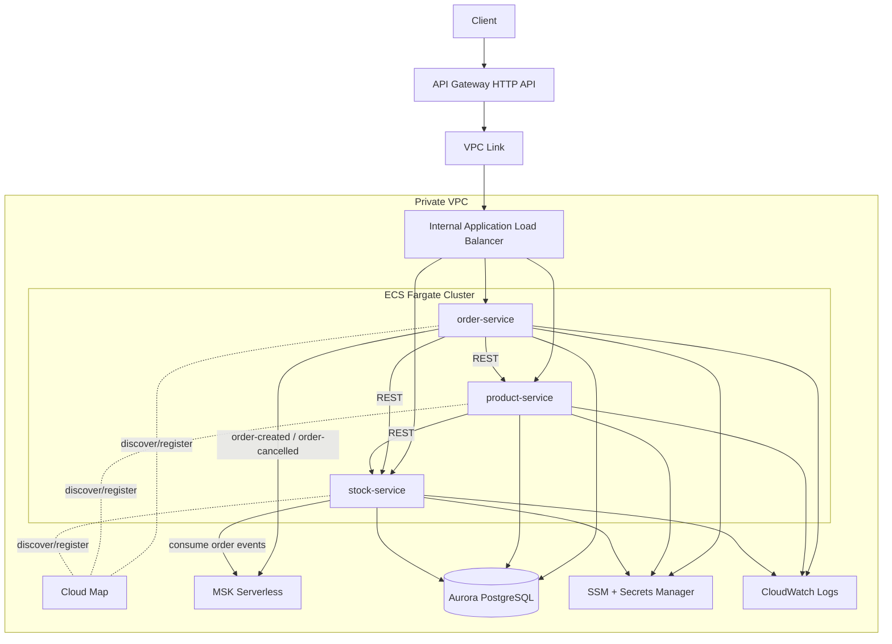

# AWS Implementation README

This document describes the **implemented AWS deployment** for this project and how to build, deploy, verify, and troubleshoot it.

## Scope

- Region: `us-east-2`
- Runtime: `ECS Fargate`
- Edge: `API Gateway HTTP API` + `VPC Link` + internal `ALB`
- Service discovery: `AWS Cloud Map`
- Database: `Aurora PostgreSQL`
- Messaging: `Amazon MSK Serverless` (IAM auth)
- Config & secrets: `SSM Parameter Store` + `Secrets Manager`
- Observability: `CloudWatch Logs` (+ optional X-Ray support)

---

## Architecture Diagram



---

## Request Flow (Implemented)

1. Client sends request to API Gateway endpoint.
2. API Gateway forwards through VPC Link to the internal ALB.
3. ALB routes by path to the correct ECS service (`/order/*`, `/product/*`, `/stock/*`).
4. `order-service` performs synchronous validation calls to `product-service` and `stock-service`.
5. `order-service` publishes Kafka events to MSK (`order-created`, `order-cancelled`).
6. `stock-service` consumes events and updates stock state.

---

## Terraform Structure

- `terraform/phase1-core`: networking, ECS/ECR, IAM, ALB, API Gateway, Cloud Map, data, service deployment.
- `terraform/phase2-support`: observability resources (logs/alarms/dashboard/X-Ray sampling).

Recommended apply order:

1. Apply `phase1-core` with `deploy_services = false`
2. Set MSK bootstrap brokers in SSM parameter
3. Build/push service images
4. Re-apply `phase1-core` with `deploy_services = true`
5. Apply `phase2-support`

---

## Build and Push (Order Service Example)

```bash
export JAVA_HOME=$(/usr/libexec/java_home -v 21)
export PATH="$JAVA_HOME/bin:$PATH"

mvn -f order-service/pom.xml -DskipTests package

aws ecr get-login-password --region us-east-2 \
  | docker login --username AWS --password-stdin 221342428586.dkr.ecr.us-east-2.amazonaws.com

docker buildx build --platform linux/amd64 \
  -t 221342428586.dkr.ecr.us-east-2.amazonaws.com/cs590-microservices/demo/order-service:latest \
  --push order-service
```

---

## Redeploy ECS Service

```bash
aws ecs update-service \
  --cluster cs590-microservices-demo-cluster \
  --service order-service \
  --force-new-deployment \
  --region us-east-2

aws ecs wait services-stable \
  --cluster cs590-microservices-demo-cluster \
  --services order-service \
  --region us-east-2
```

---

## Current Kafka Topic Strategy in Code

`order-service` includes startup topic beans:

- `order-created`
- `order-cancelled`

And enables:

- `spring.kafka.admin.auto-create=true`

This allows Spring Kafka Admin to attempt topic creation on startup (assuming MSK IAM permissions include topic creation).

---

## Required IAM Permissions for ECS Task Role (Kafka)

At minimum ensure task role permits:

- `kafka-cluster:Connect`
- `kafka-cluster:CreateTopic`
- `kafka-cluster:DescribeCluster`
- `kafka-cluster:DescribeTopic`
- `kafka-cluster:ReadData`
- `kafka-cluster:WriteData`
- `kafka-cluster:DescribeGroup`
- `kafka-cluster:AlterGroup`

---

## Verification Checklist

1. ECS service is stable (`desired=running`, no pending tasks).
2. ALB target for `order-service` is `healthy`.
3. `GET /order` returns HTTP `200`.
4. `POST /order` returns successfully (no timeout).
5. CloudWatch logs show successful Kafka send and no `UNKNOWN_TOPIC_OR_PARTITION` errors.

---

## Quick Troubleshooting

### `POST /order` times out

- Check order-service logs for Kafka metadata/topic errors.
- Confirm MSK bootstrap brokers in SSM parameter are correct.
- Confirm task role includes `CreateTopic` and `WriteData`.
- Confirm security group path from ECS to MSK broker port `9098` is allowed.

### ECS rollout does not pick latest image

- Re-run image build/push with `:latest`.
- Force new deployment using `aws ecs update-service --force-new-deployment`.
- Confirm active task is newly started and image digest updated.

---

## Related Docs

- `README.md`
- `AWS_CLOUD_ARCHITECTURE_GUIDE.md`
- `AWS_HANDS_ON_IMPLEMENTATION_CHECKLIST.md`
- `terraform/README.md`
